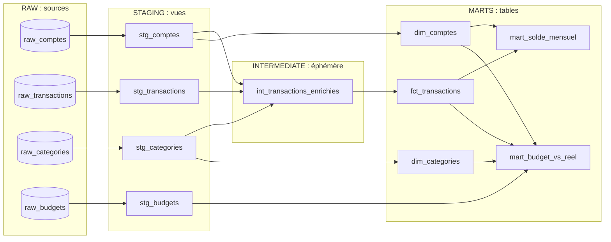

# FinTrack Analytics : entrepôt de données Snowflake + dbt

FinTrack Analytics est une fintech fictive qui propose une application de gestion de finances personnelles. Ce projet transforme ses données brutes (comptes, transactions, catégories, budgets) en modèles analytiques fiables, prêts à alimenter des tableaux de bord financiers.

- **Snowflake** héberge les données : base `FINTRACK_DB`, schémas `RAW`, `STAGING` et `MARTS`.
- **dbt** construit la chaîne de transformation, la teste et la documente.

Projet réalisé d'après le sujet « Snowflake + dbt : FinTrack Analytics » (niveau débutant).

## Architecture



| Couche | Dossier | Matérialisation | Schéma Snowflake | Rôle |
|---|---|---|---|---|
| Sources | `RAW` | tables chargées par script | `RAW` | Données brutes, jamais modifiées par dbt |
| Staging | `models/staging/` | vue | `STAGING` | Renommer, typer, nettoyer les sources |
| Intermediate | `models/intermediate/` | éphémère | aucun | Jointures et enrichissements, injectés comme CTE |
| Marts | `models/marts/` | table | `MARTS` | Modèles finaux pour la BI |

## Structure du dépôt

```
.
├── snowflake/                      Scripts Snowflake, à exécuter dans l'ordre
│   ├── 00_setup_environnement.sql    entrepôt, base, schémas, rôle, utilisateur
│   ├── 01_creer_tables.sql           les 4 tables sources du schéma RAW
│   ├── 02_inserer_donnees.sql        données d'exemple (12 / 6 / 45 / 25 lignes)
│   └── 03_verifications.sql          contrôles après chargement
├── models/
│   ├── staging/                    stg_*.sql, _stg_sources.yml, _stg_models.yml
│   ├── intermediate/               int_transactions_enrichies.sql, _int_models.yml
│   └── marts/                      dim_*, fct_*, mart_*, _marts_models.yml
├── tests/                          test singulier : assert_solde_mensuel_positif.sql
├── macros/                         generate_schema_name.sql
├── dbt_project.yml
└── packages.yml                    dbt_utils, codegen
```

## Démarrage

### 1. Préparer Snowflake

Dans une feuille Snowsight, exécutez les scripts de `snowflake/` dans l'ordre (`00`, `01`, `02`, puis `03` pour contrôler). Un compte d'essai Snowflake suffit : son rôle `ACCOUNTADMIN` donne accès à `SYSADMIN`, `SECURITYADMIN` et `USERADMIN`, utilisés par le script 00.

> **Avant d'exécuter `00_setup_environnement.sql`**, remplacez `<MOT_DE_PASSE_A_DEFINIR>` par votre propre mot de passe pour `FINTRACK_USER`. Ne le versionnez jamais.

Le script 00 accorde à `FINTRACK_ROLE` la lecture seule sur `RAW` et tous les droits sur `STAGING` et `MARTS`. Le rôle ne peut pas créer de schéma : c'est la raison d'être de la macro `generate_schema_name`.

### 2. Configurer dbt

```bash
pip install dbt-snowflake      # dbt-core 1.10.5 ou plus récent
```

Créez `~/.dbt/profiles.yml`. Le nom du profil doit être celui de `dbt_project.yml` :

```yaml
finetrack_analytics:
  target: dev
  outputs:
    dev:
      type: snowflake
      account: <votre_compte>         # ex : xy12345.eu-west-1
      user: FINTRACK_USER
      password: '<votre_mot_de_passe>'
      role: FINTRACK_ROLE
      database: FINTRACK_DB
      warehouse: FINTRACK_WH
      schema: STAGING
      threads: 2
```

La connexion par mot de passe est valable sur un compte d'essai. Sur un compte payant ou d'entreprise, Snowflake impose une authentification renforcée : utilisez alors une paire de clés RSA.

### 3. Construire, tester, documenter

```bash
dbt deps               # installe dbt_utils et codegen
dbt debug              # vérifie la connexion
dbt build              # construit les modèles et exécute les tests, dans l'ordre du DAG
dbt docs generate      # génère la documentation et le lineage
dbt docs serve         # l'ouvre dans le navigateur
```

Lancez toujours dbt avec `FINTRACK_ROLE`, pas avec `ACCOUNTADMIN` : les objets créés appartiendraient à `ACCOUNTADMIN` et `FINTRACK_ROLE` ne pourrait plus les remplacer.

## Les modèles

| Modèle | Contenu |
|---|---|
| `stg_comptes` | Comptes : `id` devient `compte_id`, statut en minuscules |
| `stg_transactions` | Transactions typées, avec `montant_signe` (+ pour un crédit, - pour un débit) |
| `stg_categories` | Catégories renommées : `categorie_id`, `nom_categorie`, `type_categorie` |
| `stg_budgets` | Budgets mensuels, mois typé en `DATE` |
| `int_transactions_enrichies` | Transactions + client, type de compte, catégorie, groupe et `mois_transaction` |
| `dim_comptes` | Dimension des comptes, avec `anciennete_jours` |
| `dim_categories` | Dimension des catégories |
| `fct_transactions` | Faits : transactions **validées** uniquement |
| `mart_solde_mensuel` | Crédits, débits, solde net et solde cumulé par compte et par mois |
| `mart_budget_vs_reel` | Dépenses réelles contre budget par compte, catégorie et mois (`FULL OUTER JOIN`) |

Chaque modèle et chaque colonne est décrit dans les fichiers YAML de sa couche (`_stg_models.yml`, `_int_models.yml`, `_marts_models.yml`) et les sources dans `_stg_sources.yml`.

## Qualité des données

53 tests, tous exécutés par `dbt build` :

| Type | Nombre | Exemples |
|---|---|---|
| `not_null` | 26 | clés, statuts, montants, types d'opération |
| `unique` | 7 | `compte_id`, `transaction_id`, `categorie_id`, `budget_id` |
| `relationships` | 9 | transactions vers comptes et catégories, faits vers dimensions |
| `accepted_values` | 5 | `type_compte`, `statut`, `type_operation`, `type_categorie` |
| `unique_combination_of_columns` | 3 | grain de `stg_budgets` et des deux marts |
| `accepted_range` | 1 | `montant` strictement positif |
| `expression_is_true` | 1 | `mois` des budgets = premier jour du mois |
| singulier | 1 | `assert_solde_mensuel_positif` : aucun compte épargne à solde cumulé négatif |

`accepted_values` et `relationships` ignorent les valeurs `NULL` : c'est pourquoi les colonnes concernées ont aussi un test `not_null`. Sans lui, une transaction sans statut disparaîtrait des marts sans qu'aucun test n'échoue.

## Choix de conception

- **Staging sans filtre.** Les vues restent en correspondance une pour une avec les sources : les anomalies sont signalées par les tests au lieu d'être masquées. Seul `fct_transactions` filtre (`statut = 'validee'`).
- **`montant_signe` vaut `NULL` pour un type d'opération inconnu**, et non 0 : le test `not_null` le signale.
- **Jointures `LEFT JOIN`** dans `int_transactions_enrichies` : une transaction dont le compte ou la catégorie serait introuvable reste visible, et les tests `relationships` la signalent.
- **`mart_solde_mensuel`** a une ligne par compte et par mois comptant au moins une transaction validée. Un mois sans transaction n'a pas de ligne, et un compte sans transaction validée (le compte clôturé de l'échantillon) n'apparaît pas. Le solde cumulé n'est le solde réel que si toutes les transactions depuis l'ouverture sont chargées, ce qui n'est pas le cas de l'échantillon (janvier à mars 2024).
- **`mart_budget_vs_reel`** : `ecart = montant_reel - montant_prevu` (positif = dépense supérieure au budget). `depassement` n'est vrai que si un budget existe : une dépense sans budget (`montant_prevu = 0`) n'est pas un dépassement de budget. Pour repérer les dépassements, filtrez sur `depassement`, pas sur le signe de `ecart`.
- **`type_categorie` et `type_operation` sont deux axes indépendants.** Les virements reçus sur le compte épargne sont des crédits rangés dans « Épargne versée », une catégorie de type `depense`.
- **`generate_schema_name`** : par défaut, dbt nommerait les schémas `<schéma du profil>_<schéma personnalisé>`, par exemple `STAGING_MARTS`, que `FINTRACK_ROLE` n'a pas le droit de créer. La macro utilise le schéma personnalisé tel quel.

## Résultats attendus sur l'échantillon

Après `dbt build`, ces valeurs doivent apparaître :

| Compte | Solde cumulé fin mars 2024 |
|---|---|
| 1 Alice Dupont | 7 350,83 |
| 2 Bob Martin | 5 476,92 |
| 3 Claire Leroy | 5 900,00 |
| 4 David Moreau | 7 748,70 |
| 5 Emma Bernard | 2 355,00 |
| 6 Frank Petit | aucune ligne (aucune transaction validée) |

`fct_transactions` compte 43 lignes sur 45 : une transaction en attente et une rejetée sont exclues. `mart_budget_vs_reel` compte 32 lignes dont 2 dépassements : Alice, Restaurant, février 2024 (60 prévus, 89 dépensés) et Bob, Vêtements, janvier 2024 (80 prévus, 120 dépensés).

## Validation

- `dbt build` sur Snowflake : 62 nœuds (9 modèles et 53 tests), 0 erreur.
- Les tables `fct_transactions`, `mart_solde_mensuel`, `mart_budget_vs_reel` et `dim_comptes` ont été comparées, ligne par ligne, à un calcul indépendant en Python : résultats identiques.
- Les tests ont été éprouvés en corrompant volontairement les données (doublon, compte inconnu, statut `NULL`, montant négatif, budget en double, retrait massif sur le compte épargne...) : chaque corruption fait échouer le test attendu.

Après avoir modifié des données sources, relancez `dbt build` et non `dbt test` seul : les tests des marts portent sur les tables telles qu'elles ont été construites la dernière fois.

## Questions du sujet

**Quelle différence entre vue, table et éphémère ?** Une *vue* stocke la requête et la rejoue à chaque lecture : toujours à jour, mais recalculée. Une *table* stocke le résultat : rapide à lire, mise à jour à chaque `dbt run`. Un modèle *éphémère* ne crée aucun objet : dbt l'injecte comme CTE dans les modèles qui l'utilisent. D'où les choix : vues pour le staging (données changeantes, calcul léger), éphémère pour les jointures intermédiaires (jamais lues directement), tables pour les marts (lus souvent par la BI).

**Pourquoi séparer staging, intermediate et marts ?** Chaque couche a une seule responsabilité : le staging isole le contact avec les sources (si une colonne change à la source, un seul fichier est à corriger), l'intermediate factorise les jointures, les marts exposent des modèles finaux et stables à la BI. Cela rend les modèles lisibles, réutilisables et testables à la bonne étape.

**Quel avantage pour le test `relationships` ?** Snowflake n'applique pas les clés étrangères. Le test vérifie l'intégrité référentielle : une transaction qui pointe vers un compte ou une catégorie inexistants est détectée avant de fausser les agrégats des marts.

## Sécurité

Aucun secret n'est versionné : `profiles.yml`, les clés privées et le fichier `.env` sont ignorés par Git. Le mot de passe de `FINTRACK_USER` se règle dans le script 00 avant exécution, puis se recopie dans `~/.dbt/profiles.yml`.
